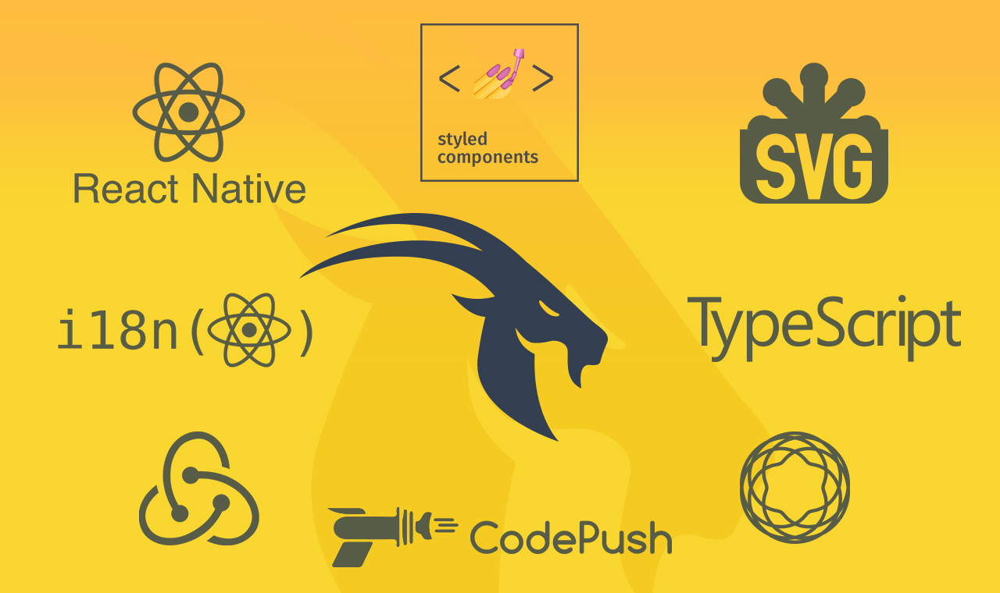

<div align="center">
 
</div>

<br/>

A well-structured React Native Boilerplate with Typescript, Redux, Jest & Enzyme support  and everything you'll ever need to deploy rock solid apps.

<br/>

<div align="center">
  <!-- Dependency Status -->
  <a href="https://david-dm.org/pankod/react-native-boilerplate">
    
  </a>
  <!-- devDependency Status -->
  <a href="https://david-dm.org/pankod/next-boilerplate#info=devDependencies"> 
    
  </a>
  <!-- Build Status -->
  <a href="https://travis-ci.org/pankod/react-native-boilerplate">
    
  </a>
</div>


<br/>
<div align="center">
  <sub>Created by <a href="https://www.pankod.com">Pankod</a></sub>
</div>


## About

React Native lets you build mobile apps using JavaScript. It uses the same design as React, letting you compose a rich mobile UI from declarative components.

It offers faster mobile development, and more efficient code sharing across iOS, Android, and the Web, without sacrificing the end user’s experience or application quality.

This boilerplate is useful to kick-start your project, as it provides latest powerfull tools which specified at the below.

<br/>

## Features


This boilerplate includes the latest powerfull tools.


* **Typescript** - Superset of JavaScript which primarily provides optional static typing, classes and interfaces. path support(allias)
* **React Navigation** - Start quickly with built-in navigators that deliver a seamless out-of-the-box experience.
* **Redux** - State management
* **Redux Persist** - Persist and rehydrate a redux store.
* **Styled Components** - Utilising tagged template literals (a recent addition to JavaScript) and the power of CSS, 
* **Babel** -  The compiler for next generation JavaScript. Module(alias) support 
* **TSLint** - Contains TypeScript-specific options for our project.
* **CodePush** - CodePush is a cloud service that enables Cordova and React Native developers to deploy mobile app updates directly to their users' devices.
* **React Native SVG** - React Native SVG provides SVG support to React Native on iOS and Android.
* **Splash Screen** - A splash screen API for react-native which can programatically hide and show the splash screen. Works on iOS and Android.
* **React-i18next** - Integrates I18n with React Native. Uses the user preferred locale as default. 
* **Jest and Enzyme support** - Complete and ready to set-up JavaScript testing solution. Works out of the box for any React project.


<br/>

*Here are a few highlights to look out for in this boilerplate*

<dl>
  
  <dd>The boilerplate includes tsconfig.json which contains a list of your input files as well as all your compilation settings.<dd>

  >One of TypeScript’s core principles is that type-checking focuses on the shape that values have. This is sometimes called “duck typing” or “structural subtyping”. In TypeScript, interfaces fill the role of naming these types, and are a powerful way of defining contracts within your code as well as contracts with code outside of your project.

 
  <dd>Styled Components <dd>

  >Styled Components allow you to write plain CSS in your components without worrying about class name collisions. It's a way to write CSS that’s scoped to a single component, and not leak to any other element in the page.

  
  <dd>CodePush <dd>

  >The CodePush plugin helps get product improvements in front of your end users instantly, by keeping your JavaScript and images synchronized with updates you release to the CodePush server. This way, your app gets the benefits of an offline mobile experience, as well as the "web-like" agility of side-loading updates as soon as they are available

</dl>

<br/>

## Getting Started


1. Clone the repository and install the dependencies:

```sh
git clone https://github.com/pankod/react-native-boilerplate
```


2. To create a new app, go to the choosen app directory on the CLI then run one of the following methods:

**npm**

```sh
npm install
```


3. Once the installation is done, you can run the following command:

**ios**

 ```
 npm run ios
 ```
 
**android**

 ```
 npm run android
 ```
 <br/>

 ### Predefined commands on package.json


Cache clear and restart react native bundler

 ```
 npm run clear
 ```

Bundler analyzer 

 ```
 npm run start
 ```

Run the tests

 ```
 npm run test
 ```

 <br/>

 ***At this point, your project layout should look like this:***
 
 <br/>

```
.
├── android
├── ios
├── scenes
│   ├── Apod
│   │   ├── __snapshots__
│   │   │   └── index.spec.tsx.snap
│   │   ├── index.spec.tsx
│   │   ├── index.tsx
│   │   └── styled.ts
│   └── Home
│       ├── __snapshots__
│       │   └── index.spec.tsx.snap
│       ├── index.spec.tsx
│       ├── index.tsx
│       └── styled.ts
├── src
│   ├── Actions
│   │   ├── HomeActions
│   │   │   ├── index.spec.tsx
│   │   │   └── index.ts
│   │   └── index.ts
│   ├── App.tsx
│   ├── Components
│   │   ├── Heading
│   │   │   ├── Heading.d.ts
│   │   │   ├── __snapshots__
│   │   │   │   └── index.spec.tsx.snap
│   │   │   ├── index.spec.tsx
│   │   │   ├── index.tsx
│   │   │   └── styled.ts
│   │   └── index.ts
│   ├── Definitions
│   │   ├── ActionConsts
│   │   │   ├── index.spec.ts
│   │   │   └── index.ts
│   │   ├── Styled
│   │   │   ├── index.ts
│   │   │   └── theme.ts
│   │   └── index.ts
│   ├── I18n
│   │   ├── index.ts
│   │   └── locales
│   │       ├── en
│   │       │   ├── common.json
│   │       │   ├── home.json
│   │       │   └── index.ts
│   │       ├── es
│   │       │   ├── common.json
│   │       │   ├── home.json
│   │       │   └── index.ts
│   │       ├── index.ts
│   │       └── tr
│   │           ├── common.json
│   │           ├── home.json
│   │           └── index.ts
│   ├── Interfaces
│   │   ├── Scenes
│   │   │   └── Home.d.ts
│   │   ├── index.ts
│   │   └── styled.d.ts
│   ├── Redux
│   │   ├── IAction.d.ts
│   │   ├── IStore.d.ts
│   │   ├── Reducers
│   │   │   ├── home
│   │   │   │   ├── index.spec.ts
│   │   │   │   └── index.ts
│   │   │   └── index.ts
│   │   ├── index.ts
│   │   └── store.ts
│   ├── Router
│   │   └── index.tsx
│   ├── Services
│   │   ├── API
│   │   │   ├── Http
│   │   │   │   ├── Http.d.ts
│   │   │   │   ├── index.spec.ts
│   │   │   │   └── index.ts
│   │   │   └── Planetary
│   │   │       ├── ApodPayload.d.ts
│   │   │       ├── ApodResponse.d.ts
│   │   │       ├── Planetary.d.ts
│   │   │       ├── index.spec.ts
│   │   │       └── index.ts
│   │   ├── RouterActions.tsx
│   │   └── index.ts
│   └── Styled
│       └── index.tsx
├── static
│   └── images
│       └── pankod-logo.png
├── test
│   ├── Helpers
│   │   └── render.tsx
│   ├── jest.setup.ts
│   ├── mocks.ts
│   └── tsconfig.jest.json
├── tsconfig.json
├── README.md
├── app.json
├── babel.config.js
├── global.d.ts
├── index.js
├── jest.config.js
├── metro.config.js
├── package-lock.json
├── package.json
├── pankod_cover.jpg
└── yarn.lock

```

## License

Licensed under the MIT License, Copyright © 2018-present Pankod
